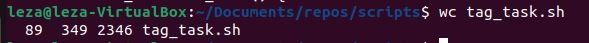

# Int_2023
## Learning Linux

*These notes are for self-learning purpose. It contains details of some of the most important Linux Commands with their syntax and examples. I have also attached snapshots for deep understanding.*

### 1. whoami

This command prints the current user logged in.The output displays the username of the effective user in the current shell.
		
  		`whoami` : displays the name of the current user

The whoami command accepts only two options:

* -h, --help 	: Display a help message and exit.
  
* -V, --version : Shows the version information and exit.

    

   

### 2. man *(manual)*

This command shows the manual of a command. It provides a detailed view of the command which includes NAME, SYNOPSIS, 		DESCRIPTION, OPTIONS, EXIT STATUS, RETURN VALUES, ERRORS, FILES, VERSIONS, EXAMPLES, AUTHORS and SEE ALSO.
	
 **Example:**		
  		
		`man ls` : this displays the manual of ls command

Following are the options we can use with man command:

* -h, --help : Print a help message and exit.
* -V, --version	: Display version information and exit.
* -C file, --config-file=file1 : Use configuration file file1 rather than the default of ~/.manpath.
* -d, --debug : Print debugging information.
* -D, --default : This option, when used, is normally specified as the first option; it resets man's behaviour to its default. Its use is to reset those options that may have been set in $MANOPT. Any options that follow -D will have their usual effect.

    

### 3. clear

This command clears the screen. We can clear our terminal by using short cut `CTRL+L`.This command deletes everything, including the scrollback buffer. To keep the scrollback buffer, use clear with the -x argument. Additionally, the clear command does not reset the terminal. The shell state remains the same as before.

		`clear` : This command clears the terminal
  

The clear -x command clears the terminal, but previous output is still available. Scroll up or use the PgUp button

		`clear -x` : Clears the terminal and to see previous output use page up or scroll up.		

### 4. pwd *(print working directory)*

This command prints the full name of the current/working directory.

Following are the options we can use with pwd command:

* -L (logical) : Use PWD from environment, even if it contains symbolic links
* -P (physical)	: Avoid all symbolic links
* –help	 : this help and exit
* –version : Output version information and exit

### 5. ls *(list)*

This command prints the list of folders in current directory.It is designed to list the names and features of files and directories. It can be used for a single file or as many as all files and folders in a selected set of directories.

Following are the flags used with ls command:

* `ls -a`	*list all files including hidden file starting with '.'.*
* `ls -d`	*list directories - with ' */'.*
* `ls -l`	*list with long format - show permissions.*
* `ls -F`	*Append indicator (one of */=>@|) to entries.*
* `ls -lh`	*This command will show you the file sizes in human readable format.*
* `ls -r`	*list in reverse order.*
* `ls -i`	*list file's inode(index) number.*
* `ls -ltr`	*View Reverse Output Order by Date.*
* `ls -t`	*sort by time & date.*
* `ls -n`	*It is used to print group ID and owner ID instead of their names.*
* `ls -m`	*A list of entries separated by commas should fill the width.*
* `ls -g`	*This allows you to exclude the owner and group information columns.*
* `ls -q`	*Force printing of non-graphic characters in file names as the character `?';.*
* `ls -Q`	*Place double quotations around the entry names.*

   

### 6. cd *(change directory)*

cd stands for change directory. It is used to change the current directory of the terminal. The terminal, by default, opens the home directory.
		
  		
		`cd dir` 	: Changes the current directory (1 step forward)
		`cd..` 		: Goes back to parent folder (1 step back)
		`cd../../..` 	: Goes back to 3 folders back (3 steps back)

### 7. mkdir *(make directory)*

This command creates a directory. This command can create multiple directories at once as well as set the permissions for the directories.
	
 		`mkdir pictures` : Creates a directory with pictures name
		`mkdir -p folder1/folder2/folder3 ` : Creates a nested directory

### 8. touch
	
 This command creates a file. It can make an empty file or modify the file timestamps (file access time, last date, or modification).
    		
		`touch temp.txt` : Creates a file with the name temp.txt

Following are the options used with touch command:

* -a, change the access time only
* -c, if the file does not exist, do not create it
* -d, update the access and modification times
* -m, change the modification time only
* -r, use the access and modification times of the file
* -t, creates a file using a specified time

### 9. rmdir *(remove directory)*
	
The rmdir command removes the directory, specified by the Directory parameter, from the system. The directory must be empty before you can remove it, and you must have write permission in its parent directory.

Following are the options ised with rmdir command:

* -p: This option removes the DIRECTORY and any empty parent directories.
* -v: This option displays a message for each removed directory.
* --ignore-fail-on-non-empty: This option suppresses error messages if a directory is not empty.
* --help: This option displays the help message for the rmdir command.

### 10. rm *(remove)*
	
It is used to remove files, directories, and links. By default, it does not remove directories. This command normally works silently and it should be used carefully, because once you delete a file in Linux the content cannot be recovered.

  
  		`rm filename`  : Deletes nonempty file.
  		`rm -r folder` : Deletes a folder with files inside it.( r means recursive)

Following are the options used with rm command:

* rm *extension	Used to delete files having same extension.
* rm -r or R	To delete a directory recursively.
* rm -i	: Remove a file interactively.
* rm -rf : Remove a directory forcefully.
* -f : -f stands for force. It ignores files that do not exist and overrides the confirmation prompts. It will not delete files through a directory when it is write-protected.
* -v : -v stands for verbose. It prints what the rm command is doing in the terminal.
* -d : -d stands for directory. It removes an empty directory and works only if the named directory is empty.
* --one-file-system : It only deletes files on a similar file system like the argument and will avoid the mounted file system.

### 11.  open
	
 Open command opens a file/folder outside the terminal but only on MAC.
 
 		`open filename` : Opens the file on MAC
		`open . ` 	:  Opens the current directory on MAC

  
xdg-open opens a file or URL in the user's preferred application. If a URL is provided the URL will be opened in the user's preferred web browser. If a file is provided the file will be opened in the preferred application for files of that type. xdg-open supports file, ftp, http and https URLs.
	
		`xdg-open .` 		: Opens the current directory on Ubuntu
		`xdg-open filename`	: Opens the file on Ubuntu
  

  
### 12.  mv *(move)*
	
 Renames a file. We can use the mv command to move files and directories from one directory to another or to rename a file or directory. If you move a file or directory to a new directory without specifying a new name, it retains its original name.
		
  		
    		`mv filename1 filename2` : Renames filename1 to filename2

​Also used to move files inside a folder/directory.

		`mkdir stuff` 			: creates a folder name stuff
		`touch pie cake cookie` 	: creates 3 files pie, cake and cookie    
		`mv pie cake cookie stuff/` 	: Moves the 3 files(pie,cake,cookie) inside the folder stuff

Following are the options used with mv command:

* -i	Interactive mode. Ask before overwriting destination files.
* -f	Force the move. If a destination file exists, overwrite it unconditionally

### 13.  cp *(copy)*
	
Copies a file. Use the cp command to create a copy of the contents of the file or directory specified by the SourceFile or SourceDirectory parameters into the file or directory specified by the TargetFile or TargetDirectory parameters.
 
 		`cp filename1 filename2` : Copes the content of the first file (filename1) to the second file (filename2)

​Also used to copy a file and move the new file inside a folder/directory.
		
  		`cp file.txt folder/newfile.txt` : copies the file.txt and saves the newfile.txt inside the folder

Following are the options used with cp command:

* cp -a: This option is used to archive the existing files in the directory for retention purpose.
* cp -f: This option forcefully copy the files even it may remove the target file if needed. It is applicable if the file is already in use.
* cp -i: This option stands for interactive mode, which means that it will ask the user to overwrite the file by prompt.
* cp -l: This option is used to link a file with another existing one instead of copying it.
* cp -L: It is will create a symbolic link for the file.
* cp -n: This option is used not to overwrite any existing file.
* cp -R: This option means recursive copy means that it will copy all files with a cascading directory, including hidden file.
* cp -u: This means update, copy when the source file is new than the destination file.
* cp -v: This option stands for verbose which means that will it print all the process which happens on a file while copying.

### 14.  head
	
Linux head command prints the first lines of one or more files (or piped data) to standard output. By default, it shows the first 10 lines. However, head provides several arguments that can be used to modify the output.
 Following are the flags used with head:
 
*	 `-n / --lines`		*show the specified number of lines*
* 	`-c / --bytes`		*show the specified number of bytes*
* 	`-v / --verbose`	*show the file name tag*
* 	`-q / --quiet`		*don't separate the content of multiple files with a file name tag*
 

  			`head filename1` 	: Outputs the first 10 lines of the file
			`head filename1 -n 100` : Outputs the first 100 lines of the file

Following are the options used with head command:

* -n	--lines	: show the specified number of lines
* -c	--bytes	: show the specified number of bytes
* -v	--verbose : show the file name tag
* -q	--quiet : don't separate the content of multiple files with a file name tag

### 15.  tail
	
 Tail is a command which prints the last few number of lines (10 lines by default) of a certain file, then terminates.
 
*	 `-n / --lines`		*show the specified number of lines*
* 	`-c / --bytes`		*show the specified number of bytes*
*	 `-v / --verbose`	*show the file name tag*	
*	 `-q / --quiet`		*don't separate the content of multiple files with a file name tag*

  		 tail filename1` : Outputs the last 10 lines of the file

​With -n we can specify the number of lines to print

		`tail filename1 -n 100` : Outputs the last 100 lines of the file

Following are the options used with tail command:

* -n / --lines : Limit output to the last n lines/limit output to the lines following from line n
* -c / --bytes : Limit output to the last n bytes/limit output to the bytes following from byte n
* -q / --quiet, --silent : When using multiple files, suppress the output of the file names
* -v / --verbose : Force output of file names when used with multiple files
* --help : View Help section for command
* --version : View version information of command

### 16. date
	
This command outputs the system date and time. Date command is also used to set date and time of the system. By default the date command displays the date in the time zone on which unix/linux operating system is configured.

 
These are the most common formatting characters for the date command:	

* 	`%D` – Display date as mm/dd/yy
* 	`%Y` – Year (e.g., 2020)
* 	`%m` – Month (01-12)
* 	`%B` – Long month name (e.g., November)
* 	`%b` – Short month name (e.g., Nov)
* 	`%d` – Day of month (e.g., 01)
* 	`%j` – Day of year (001-366)
*	`%u` – Day of week (1-7)
*	`%A` – Full weekday name (e.g., Friday)
*	`%a` – Short weekday name (e.g., Fri)
* 	`%H` – Hour (00-23)
* 	`%I` – Hour (01-12)
* 	`%M` – Minute (00-59)
* 	`%S` – Second (00-60)

Following are some of the options used with date command:

* -d, --date=STRING : display time described by STRING, not 'now'
* -f, --file=DATEFILE : like --date; once for each line of DATEFILE
* -r, --reference=FILE : display the last modification time of FILE
* -s, --set=STRING : set time described by STRING
* -u, --utc, --universal : print or set Coordinated Universal Time (UTC)
* -V, --version : Print the version number of accton to standard output and quit.
* -h, --help : Prints the usage information to standard output and quit.

### 17.  > (Redirecting Standard Input - Only Overwrites)
	
Redirects the output to the specified file.
		
		`date > file.txt` : Saves the date inside file.txt
  
If we add again to the same file, it replaces the content. Only overwrites does not append.
​				

### 18.  >> (Redirecting Standard Input - Appends)
	
Redirects the output to the specified file.
		
  		`date >> file1.txt` : Saves the date inside file1.txt
		
		`whoami>> file1.txt` : Saves the username inside file1.txt

If we add again to the same file, it appends the content.

### 19.  cat
	
Outputs the whole content of the specified file. It helps us to create, view, and concatenate files.
		
  		`cat file1.txt` 		: Prints the whole output of the file1
    		
		`cat file1.txt file2.txt` 	: Prints the whole output of file1 and file2

​For saving content into a new file, we can use redirect.

		`cat file1.txt file2.txt file3.txt > newfile`

Following are the options used with cat command: 

* --show-all, -A: It is the same as -vET.
* --number-nonblank, -b: It shows the total non-empty output lines. Also, it overrides -n.
* -e: It is the same as -vE.
* --show-ends, -E: It shows the $ symbol at the completion of all lines.
* --number, -n: It gives the total of every output line.
* --squeeze-blank, -s: It suppresses redundant empty output lines.
* -t: It is the same as -vT.
* --show-tabs, -T: It shows TAB characters as ^|.
* -u: ignored.
* --show-nonprinting, -v: It uses M- and ^ notation, except TAB and LFD.
* --version: It displays the information of the output version and exit.
* --help: It shows the help menu and exit.

### 20.  less
	
Outputs the whole content of the specified file in an interactive UI. The less command is Linux utility which can be used to read contents of text file one page (one screen) per time. It has faster access because if the file is large, it doesn't access the complete file, but accesses it page by page.
		
  
		`less file1.txt` : Prints the output of the file1 in an interactive UI

Following are the options used with less command:

* -E : less automatically exits upon reaching the end of file.
* -f : Forces less to open non-regular files (a directory or a device-special file).
* -F : Exit less if the entire file can be displayed on the first screen.
* -g : Highlights the string last found using search. By default, less highlights all strings matching the last search command.
* -G : Removes all highlights from strings found using search.
* -i : Ignores case sensitivity during search.
* -J : Displays a status column on the left side of the screen. The status column shows the lines that matched the current search and any lines marked using the m or M command.
* -m : Instructs less to prompt verbosely (similar to more), showing the percentage into the file. By default, less prompts with a colon.
* -M : Instructs less to prompt even more verbosely than more.
* -n : Removes line numbers from the screen.
* -N : Displays line numbers at the beginning of each line.
* -o[file_name]	: Causes less to copy its input to the specified file. This option applies only when the input file is a pipe (|), not an ordinary file. For existing files, less asks for confirmation before overwriting the file.
* -p[pattern] : Instruct less to start at the first occurrence of the specified pattern in the input file.
* -Q : Enforces quiet operation that silences the terminal bell.
* -s : Merges consecutive blank lines into a single blank line.
* -X : Disable clearing the screen after quitting less.
* -z[n] : Changes the default scrolling window size to the specified n lines.

### 21.  echo
	
It prints to the output the argument passed to it. It is one of the basic Linux commands used in shell scripting and Bash files to display output status text at the command line.
 
		`echo "hello"` : Prints hello to the screen
  
It can append output to a file aswell.
		
		`echo "hello" >> output.txt` : This command will create a file output.txt and add hello to it

Following are the options used with echo command: 

* When the -n option is used, the trailing newline is suppressed.
* If the -e option is given, the following backslash-escaped characters will be interpreted:
* \\ - Displays a backslash character.
* \a - Alert (BEL)
* \b - Displays a backspace character.
* \c - Suppress any further output
* \e - Displays an escape character.
* \f - Displays a form feed character.
* \n - Displays a new line.
* \r - Displays a carriage return.
* \t - Displays a horizontal tab.
* \v - Displays a vertical tab.

### 22.  wc *(word count)*
	
The Linux wc command calculates a file's word, line, character, or byte count. Far from just being a utility for word processing, wc is a useful tool for a variety of system tasks.

 
Some useful command line options supported by the wc command are as following:

* 	-c, --bytes		: It is used to print the byte counts.	
* 	-m, --chars		: It is used to print the character counts.
* 	-l, --lines		: It is used to print the newline counts.	
*	 --files0-from=F	: It is used to read input from specified files.	
* 	-L, --max-line-length	: It is used to print the maximum display width.	
* 	-w, --words		: It is used to print the word counts.	
* 	--help			: It is used to display the help manual.	
* 	--version		: It is used to display the version information.

  
   		wc file1.txt` : Prints the number of lines then number words, then number of bytes in the file1.txt

  

### 23.  Piping
​	
The pipe is used to combine two or more commands, and in this, the output of one command acts as input to another command, and this command's output may act as input to the next command, and so on. It can also be visualized as a temporary connection between two or more commands/ programs/ processes.

		`date | wc` *: Outputs the line no, word count and bytes of date command*

		`cat filename1 filename2 | wc` *: This gives the word count of both the files combined*

Can also be used with redirect:
	
 		`cat file1 file2 | wc -l > newfile.txt` *: This command will concatenate both the files and then count the number of lines and save them in newfile.txt*

### 24.  sort
	
It prints the sorted information on the screen, doesn't change the file.  This command processes on your data (the content of the file or output of any command) and reorders it in the specified way, which helps us to read the data efficiently.

Following are the flags used with sort:

* -b	--ignore-leading-blanks		Causes sort to ignore leading blanks.
* -d	--dictionary-order		Causes sort to consider only blanks and alphanumeric characters.
* -f	--ignore-case			Ignores the default case, changes all lowercase letters to uppercase before comparison.
* -M	--month-sort			Sorts lines according to months (Jan-Dec).
* -h	--human-numeric-sort		Compares human-readable numbers (e.g., 2K 1G).
* -n	--numeric-sort			Compares data according to string numerical values.
* -R	--random-sort			Sorts data by a random hash of keys but groups identical keys together.
* /	--random-source=FILE		Gets random bytes from the specified FILE.
* -r	--reverse			Reverses the comparison results.
* -c	--check,			--check=diagnose-first	Checks if the input is already sorted but doesn't sort it.
* /	--debug				Annotates the part of the line used for sorting.
* -k	--key=KEYDEF			Sort data using the specified KEYDEF, which gives the key location and type.
* -m	--merge				Causes sort to merge already sorted files.
* -o	--output=FILE			Redirects the output to FILE instead of printing it in standard output.
* -t	--field-separator=SEP		Uses the specified SEP separator instead of non-blank to blank transition.
* -z	--zero-terminated		Causes sort to use NUL as the line delimiter instead of the newline character.
* /	--help				Displays the help file with full options list and exits.
* /	--version			Outputs the program version and exits.
 
		

  		`sort filename` : Outputs the sorted file alphabetically

 
 To sort numerically, use -n
 
		`sort -n filename` : Outputs the sorted file numerically

For unique values use -u, for reverse sort use -r

For finding unique numbers in a file
		
		`sort -un filename`

Can also be used with word count with piping
	
		`sort -un filename | wc -l` : This will give the line numbers of the uniquely sorted numbers file

### 25.  uniq
	
 It reports or omits repeated lines.

		`uniq filename` *: Only removes adjacent duplicate values*

For alphabet characters, we can first sort and then pipe it to uniq command.
	
 		`sort filename.txt | uniq` *: This will only print unique values*

But this can easily be done with the sort command with -u

For finding duplicates only, with uniq use -d
		
  		`sort filename.txt | uniq -d`

*Example:* 	

*Apples*

*Bananas*

For finding non-duplicates only, with uniq use -u
	
		`sort filename.txt | uniq -u`
			
*Example:* 	
	
 *Pear*

For finding count, with uniq use -c

		`sort filename.txt | uniq -c`
			
*Example:* 	

*4 Apples*
 
*6 Bananas*
   
*1 Pear*

For finding count in asc order, with uniq use -c

		`sort filename.txt | uniq -c | sort -n`
			
*Example:* 

*1 Pear*	
 
*4 Apples*
  	
*6 Bananas*

### 26.  Expansion
	
Each time we type a command line and press the enter key, bash performs several processes upon the text before it carries out our command.
		
		`echo *` : Prints the paths of all the files and folders in the current directory

  
		`echo *.txt` : Prints the paths of all the files ending with .txt in the current directory

		`echo *.??` : Prints the paths of all the files ending with . and any two characters in the current directory ex: app.js, app.py

		`echo {a.b,c}.txt` :  This Outputs : a.txt b.txt c.txt

 
		`touch app.{js,html,css,py}` *: This creates 4 files in the current directory with names app.js, app.html app.css and app.py*
  

		`echo {1..99}` : Prints numbers from 1 till 99

### 27.  diff
	
 It shows the difference between two files. It can also compare the contents of directories.
		
		*-y : shows both files side by side*
  		
		`diff [option] file1 file2`

When working with diff, it is crucial to know how to interpret the output, which consists of:

* Output starting with < refers to the content in the first file.
* Output starting with > refers to the content in the second file.
* Line numbers corresponding to the first file.
* A special symbol. Special symbols indicate how the first file needs to be edited to match the second file. The output may display:
  * a (add)
  * c (change)
  * d (delete)
* Line numbers corresponding to the second file.

Following are the options used with diff command

* -i / : By default, diff is case sensitive. If you want it to ignore case, add the -i option to the command.
* -u / --unified : The unified format is an option you can add to display output without any redundant context lines.
* -c : The context format is a diff command-line utility option that outputs several lines of context around the lines that differ.
* -a / --text : View files as text and compare them line-by-line.
* -b / --ignore-space-change : Ignore white spaces when comparing files.
* -B / --ignore-blank-lines : Ignore blank lines when comparing files.
* --binary : Compare and write data in binary mode.
* -d--minimal : Modify the algorithm (for example, to find a smaller set of changes).
* -e / --ed : Make output a valid ed script.
* -E / --ignore-tab-expansion : Ignore tab extension when comparing files.
* -l / --paginate : Run the output through pr to paginate it.
* -N / --new-file : Treat a missing file as present but empty.
* -q / --brief : Output whether files differ without specifying details.
* -s / --report-identical-files : Output when the files are identical.
* -w / --ignore-all-space : Ignore white space when comparing files.

### 28.  find
	
Find files and folders with different criteria ( name, size, type etc ).

		`find .` : Finds every single nested file inside the current directory	
		
  		`find . -name '*.py'` : Finds every single nested file ending with .py inside the current directory
	​	
 		`find folderName -name '*.txt'` : Finds every single  file inside the folder ending with .txt
   
		`find . -type d` : Finds every single directory inside the current directory
	​	
 		`find . -type f` : Finds every single file inside the current directory
	​	
 		`find . -type d -name '*E*'` : Finds every single directory inside the current directory with E in its name

​For Case-Insensitivity use i with name ( -iname )

		`find . -name 'E*' -or -name 'F*'` : Finds every single directory/file inside the current directory with E and F in the start of  their name

 
### 29.  grep *(global regular expression print)*
	
Grep, or global regular expression print, is one of the most versatile and useful Linux commands available. It works by searching for text and strings that users define in a given file. In other words, grep enables users to search files for a particular pattern or word and see any lines that contain it.

Most common flags of grep are:

* -i : case-insensitive search.
* -l : list only the names of matching files.
* -w : which matches whole words only.
* -v : invert; this lists displays only the lines that do not match the pattern.
		

  		`grep -r "temp" .` : Searches for the word temp in all the nested files inside the current directory (Case Sensitive)

		`grep -ri "temp" .` : Searches for the word temp in all the nested files inside the current directory (Case Insensitive)

 ### 30.  du
	
Calculates the size of directory as a whole. By default, it measures the current directory and all its subdirectories, printing totals in blocks for each, with a grand total at the bottom.

		`du -m` : Shows the size of directories in megabytes

		`du -g` : Shows the size in gigabytes

		`du -h` : Shows the size in human readable size

Options:

* -0, –null : end each output line with NULL
* -a or –all : Displays disk usage information for all files and directories, including hidden ones.
* –apparent-size : print apparent sizes, rather than disk usage
* -B, –block-size=SIZE : scale sizes to SIZE before printing on console
* -c or –total : Shows the total disk usage in addition to individual usage for directories and files.
* -d, –max-depth=N : print total for directory only if it is N or fewer levels below command line argument
* -h or –human-readable : Displays sizes in human-readable format, using units such as KB, MB, GB, etc. This option makes it easier to interpret the disk usage information.
* -S, -separate-dirs : for directories, don’t include size of subdirectories
* -s or –summarize : Provides a summary of the disk usage for the specified directory or file, without displaying individual usage details for subdirectories.
* –time : show time of last modification of any file or directory
* –exclude : Excludes specific directories or files from disk usage calculation based on patterns or names.

### 31.  df
	
Calculates the size of mounted file system (how much space they allocate and how much is the free space left). By default, df command shows disk space in Kilobytes (KB) and uses the SI unit suffixes (e.g, M for megabytes, G for gigabytes) for clarity.

 
Following are the flags available for df command.
 
* ‘-a’ or ‘–all’ : Includes pseudo, duplicate, and inaccessible file systems in the output.
* ‘-B <SIZE>’ or ‘–block-size=<SIZE>’ : Scales sizes by SIZE before printing them.
* ‘-h’ or ‘–human-readable’ : Prints sizes in a human-readable format using power of 1024.
* ‘-H’ or ‘–si’ : Prints sizes in a human-readable format using power of 1000.
* ‘-i’ or ‘–inodes’ : Lists inode information instead of block usage.
* ‘-l’ or ‘–local’ : Limits listing to local file systems.
* ‘-P’ or ‘–portability’ : Uses POSIX output format for better portability.
* ‘–sync’ : Invokes sync before getting usage info.
* ‘–total’ : Elides all entries insignificant to available space and produces a grand total.
* ‘-t <TYPE>’ or ‘–type=<TYPE>’ : Limits listing to file systems of type TYPE.
* ‘-T’ or ‘–print-type’ : Prints file system type

		`df -h` : Shows the size, space etc in human readable size

### 32.  history
	
All the commands previously done/used are memorized in history. The history built-in command lets you use words from previous command lines in the command line you are typing. This simplifies spelling corrections and the repetition of complicated commands or arguments.

It has the following options: 

* -c : Clear the history list by deleting all of the entries.
* -d offset : Delete the history entry at offset OFFSET.
* -a : Append history lines from this session to the history file.
* -n : Read all history lines not already read from the history file.
* -r : Read the history file and append the contents to the history list.
* -w : Write the current history to the history file and append them to the history list
* -p : Perform history expansion on each ARG and display the result without storing it in the history list.
* -s : Append the ARGs to the history list as a single entry.

		`history`		  : Shows the history of all the previous commands used

  		`history | grep 'cookie'` : Shows the history of all the previous commands used with the word cookie

### 33.  ps
	
Display info about currently running processes. You can use it to learn more about what is happening in your system's background processes. Depending on the input parameters, this command may produce different results.

		
  		`ps` : Shows the history of all the processes running at the time
		
  		`ps ax` : Shows the history of all the processes initiated by anyone running at the time

 

### 34.  top
	
The top command is used to show the active Linux processes. It provides a dynamic real-time view of the running system. Usually, this command shows the summary information of the system and the list of processes or threads which are currently managed by the Linux kernel.

		
  		`ps` *: Shows the history of all the processes running at the time*

### 35.  kill
	
It receives signals and then react to it: to kill a process. Kill command sends a signal to a process that terminates the process. If the user doesn’t specify any signal which is to be sent along with the kill command, then a default TERM signal is sent that terminates the process.

		
  		`kill <PID>` : Kills a process with this process id
		
  		`kill -9 <PID>` : Kills a process with this process id (Brutally Kill) 

Some common signals in kill command are:

* SIGHUP	1	It hangup detected on controlling terminals or death of controlling process.
* SIGINT	2	It interrupts from keyboard.
* SIGKILL	9	It kills signal.
* SIGTERM	15	It terminates signal.

### 36.  killall
	
It receives signals and then react to it: to kill a program, can be more processes. Killall sends a signal to all processes running any of the specified commands. If no signal name is specified, SIGTERM is sent. Signals can be specified either by name (e.g. -HUP or -SIGHUP) or by number (e.g. -1) or by option -s.

		
  		`killall -9 <pname>` : Kills all the programs with the pname

	

### 37.  gzip
	
Compress a file with gzip compression protocol LZ77 (Lempel Ziv coding)

		`gzip filename` 	: Compress the file and replaces the old file with compressed one
		
  		`gzip -k filename` 	: Makes a new compressed file with the gz extension
		
  		`gzip -d filename.gz`	: Decompresses a file

### 38.  gunzip
	
De-Compress a file (use -k to keep the originals)
		
  
		`gunzip filename.gz` : Decompresses a file

### 39.  tar *(tape archive)*

Used to archive multiple files into single file (tar -> tape archive)

		
  		`tar -cf archive.tar file1 file2` : Creates a new archive file
    

​To unarchive file, use -xf

		
  		`tar -xf achive.tar` : Extracts files in the current directory

		`tar -xf achive.tar -C directory` : Extracts files in the specified directory

### 40.  nano
	
Beginner friendly editor - can run directly from your terminal. Easily modify files

		`nano filename` : Open file in terminal - can edit easily

### 41.  alias
	
Allows us to define our own aliases. We can give names to commands and use the names in that instance. It only exists in that particular instance/terminal.

  
		`alias myls='ls -la'`
		
  		`myls`= : This shows the result of ls -la command.

### 42.  xargs
	
The core purpose of xargs command is to take standard input and turn it into list of arguments that other commands who accept.

		`cat filename.txt | xargs rm` : Takes arguments from the file with the help of xargs command and passes the output (name of the files) inside the rm command.

### 43.  ln
	
Allows to create links. Similar to the idea of shortcut on windows. (We can access the programs with the help of shortcuts from our desktop.) Both the files are pointing to the same file. If you make changes in one file, you can see the same changes in the other file.

		`ln orignalfile.txt hardlink.txt`= : Outputs the same output as the original file. They are both referring/pointing to the same file in memory.

HARD LINK: If you delete the original file, hardlink file will still be there because it is still pointing to the same location in the memory.

		`ln orignalfile.txt hardlink.txt`

  

SOFT LINK: If you delete the original file, softlink file will also be deleted. The soft link is pointing to the original file not the location in memory. If original is gone softlink is also gone.

		`ln -s orignalfile.txt softlink.txt`

### 44.  who
	
When multiple users are logged in on the same system at the same time, who command displays the users logged into the system.

		
  		`who`= : Displays the users logged into the system

### 45.  su  *(Switch User)*
	
The command allows us to switch to another user within the terminal. With exit command you can exit the current user.

		
  		`su username`= : Allows to switch user with the help of password.

### 46.  sudo
	
Sudo is used to run a command as root or with elevated permissions. You must be first enabled to use sudo. You can then run commands as root by entering your password. The permissions are highly configurable.

		`sudo <command>`

Following are the options used with sudo command: 

* -V	The -V (version) option causes sudo to print the version number and exit. If the invoking user is already root, the -V option prints out a list of the defaults sudo was compiled with and the machine's local network addresses.
* -l	The -l (list) option prints out the commands allowed (and forbidden) the user on the current host.
* -L	The -L (list defaults) option lists out the parameters set in a Defaults line with a short description for each. This option is useful in conjunction with grep.
* -h	The -h (help) option causes sudo to print a usage message and exit.
* -v	If given the -v (validate) option, sudo updates the user's timestamp, prompting for the user's password if necessary. This extends the sudo timeout for another 5 minutes (or whatever the timeout is set to in sudoers) but does not run a command.
* -k	The -k (kill) option to sudo invalidates the user's timestamp by setting the time on it to the epoch. The next time sudo is run a password will be required. This option does not require a password and was added to allow a user to revoke sudo permissions from a .logout file.
* -K	The -K (sure kill) option to sudo removes the user's timestamp entirely. Likewise, this option does not require a password.
* -b	The -b (background) option tells sudo to run the given command in the background. Note that if you use the -b option you cannot use shell job control to manipulate the process.
* -p	The -p (prompt) option lets you override the default password prompt and use a custom one. The following percent ('%') escapes are supported:
* %u is expanded to the invoking user's login name;
* %U is expanded to the login name of the user the command will run as (which defaults to root);
* -c	The -c (class) option causes sudo to run the specified command with resources limited by the specified login class. The class argument can be either a class name as defined in /etc/login.conf, or a single '-' character. Specifying a class of - indicates that the command should run restricted by the default login capabilities for the user running the command. If the class argument specifies an existing user class, the command must run as root, or the sudo command must run from a shell that is already root. This option is only available on systems with BSD login classes where sudo is configured with the --with-logincap option.
* -a	The -a (authentication type) option causes sudo to use the specified authentication type when validating the user, as allowed by /etc/login.conf. The system administrator may specify a list of sudo-specific authentication methods by adding an "auth-sudo" entry in /etc/login.conf. This option is only available on systems that support BSD authentication where sudo is configured with the --with-bsdauth option.
* -u	The -u (user) option causes sudo to run the specified command as a user other than root. To specify a uid instead of a username, use #uid.
* -s	The -s (shell) option runs the shell specified by the SHELL environment variable if it's set or the shell as specified in the file passwd.
* -H	The -H (HOME) option sets the HOME environment variable to the home directory of the target user (root by default) as specified in passwd. By default, sudo does not modify HOME.
* -P	The -P (preserve group vector) option causes sudo to preserve the user's group vector unaltered. By default, sudo will initialize the group vector to the list of groups of the target user. The real and effective group IDs, however, are still set to match the target user.
* -r	The -r (role) option causes the new (SELinux) security context to have the role specified by ROLE.
* -t	The -t (type) option causes the new (SELinux) security context to have the type (domain) specified by TYPE. If no type is specified, the default type is derived from the specified role.
* -S	The -S (stdin) option causes sudo to read the password from standard input instead of the terminal device.
* --	The -- flag indicates that sudo should stop processing command line arguments. It is most useful in conjunction with the -s flag.

### 47.  passwd 
	
This command allows us to change the password of the user.

		
		`passwd` : This will allow us to change password. First it asks the current password and then allows to set new password.

To change some other user's password, first you need to have the permission then with sudo you can change password.

		`sudo passwrd user` : First you need to enter your own password and then you can change the other user's password only if you have the administration permissions.

Following are the options used with passwd command: 

* -a, --all : This option can be used only with -S and causes show status for all users.
* -d, –delete: This option deletes the user password and makes the account password-less.
* -e, –expire: This option immediately expires the account password and forces the user to change password on their next login.
* -h, –help: Display help related to the passwd command.
* -i, –inactive INACTIVE_DAYS: This option is followed by an integer, INACTIVE_DAYS, which is the number of days after the password expires that the account will be deactivated.
* -k, –keep-tokens: This option is used when you only want to change the password if it is expired. It keeps the authentication tokens for the authentication if the password is not yet expired, even if you requested to change it. Note that if the expiry period for a user is set to 99999, then this option will not keep tokens and the password will be changed.
* -l, –lock: Lock the password of user. This appends the encrypted password of the user with a character ‘!’, and thus making it unable to match with any of input password combinations. This does not disable the account but prevents the user from logging in using a password. Though other authentication methods like ssh keys can be used to login to the account.
* -n, –mindays MIN_DAYS: Change the minimum number of days between password changes to MIN_DAYS so that the user can’t change the password for MIN_DAYS.
* -q, –quiet: This option is used for quiet mode. While using this option to change a password, the message “Changing password for $user.”, which usually gets printed before changing a password, does not get echoed.
* -r, –repository REPO: This option is used to change password for repository named “REPO”.
* -R, –root CHROOT_DIR: Apply changes in the CHROOT_DIR directory and use the configuration files from the CHROOT_DIR directory. This basically changes the root directory for the passwd process for once, and since CHROOT_DIR is a sub-directory of the root, it can not access the configuration files outside the CHROOT_DIR.
* -S, –status: Shows the password status (7 fields) of user
* -S [, –status] -a [, –all]: This combination of options shows password status for all users. Note that -a or –all cannot be used without -S option.
* -u, –unlock: Unlock the password of an account.
* -w, –warndays WARN_DAYS: This option is used to change the number of days before the password is to expire, to display the warning for expiring password.
* -x, –maxdays MAX_DAYS Set the maximum number of days for which the password remains valid. After MAX_DAYS, the password will expire and the user will be forced to change password.

### 48.  chown *(Change ownership)* 
	
This command allows us to change the ownership to another user. Owner of a file can do everything with it.

		
  		`chown <owner> <file>` *: Allows the ownership/permissions of a file to another user.*

​	
To change the ownership of all the files and subdirectories nested in a directory, use the flag -R
​
		`chown -R <owner> <file>`

Following are the options used with chown command:

* -f : Suppresses all error messages except usage messages.
* -h : Changes the ownership of an encountered symbolic link and not that of the file or directory pointed to by the symbolic link.
* -H : If the -R option is specified and a symbolic link referencing a file of type directory is specified on the command line, the chown command shall change the user ID (and group ID, if specified) of the directory referenced by the symbolic link and all files in the file hierarchy below it.
* -L : If the -R option is specified and a symbolic link referencing a file of type directory is specified on the command line or encountered during the traversal of a file hierarchy, the chown command shall change the user ID (and group ID, if specified) of the directory referenced by the symbolic link and all files in the file hierarchy below it.
* -P : If the -R option is specified and a symbolic link is specified on the command line or encountered during the traversal of a file hierarchy, the chown command shall change the owner ID (and group ID, if specified) of the symbolic link if the system supports this operation. The chown command shall not follow the symbolic link to any other part of the file hierarchy.

### 49.  chmod *(Change mode)* 
	
This command allows us to change the permissions of a file or directory.

We need to tell:

* Who are we changing permissions for 
	* *(u - user/owner of file)*
   	* *(g - group/member of the group)*
   	* *(o - others)*					
	* *(a - all of the above)*

 * What changes are we making
   	* *( - (minus sign) removes permission)*
	* *( + (plus sign) grants permission)*
	* *( = (equals sign) set a permission and remove others)*

 * Which permissions are we setting.
   	* *(r - read permission)*
   	* *(w - write permission)*
   	* *(x - execute permission)*

*Example:*
		
		`chmod mode <file>` 
  		
		`chmod u+x <file>`  : Grants permission to the user of the file to execute .
		
  		`chmod a-x <file>`  : Removes permission from all (user, group, others) to execute.
		
  		`chmod a+w <file>`  : Grants permission of write to all (user, group, others).

### 50. scp *(secure copy)*

This command is used to copy file(s) between servers in a secure way. The secure copy allows the secure transferring of files between the local host and the remote host or between two remote hosts.

		`scp [option] [user_name@source_host:path/to/source/file] [user_name@target_host:target/path]`

If you omit:

* the user_name of the host (or target), the command defaults to the current user.
* the path/to/source (or the target/path) from the command, the program looks for (or copies) the file locally.

**If we want to copy a file from a local machine to a remote machine:**

		`scp [file_name]  remoteuser@remotehost:/remote/directory`
  

* *file_name = The name of the file that needs to be copied.*
* *remoteuser =The username of the remote host.*
* *remotehost = The IP address or hostname of the remote host.*
* */remote/directory = The directory where the file should be copied on the remote machine.*

 
 Example:
 
 		`scp test.txt leza@10.143.90.2:/home/leza`

**If we want to copy a file from remote machine to our local machine.**

		`scp user@remotehost:/home/user/file_name`

 
* *user = username of remote system.*
* *remotehost = IP address of remote system.*
* */home/user/file_name = path of file that has to be copied.*
* *. = this means that we are copying that file in current location in local system.*

Following are the options available for this command: 

* -P	 port: Specifies the port to connect on the remote host.
* -p	 Preserves modification times, access times, and modes from the original file.
* -q	 Disables the progress meter.
* -r	 Recursively copy entire directories.
* -s	 Name of program to use for the encrypted connection. The program must understand ssh(1) options.

### 51. ssh *(secure shell)*

The ssh command is used to securely log into a remote machine and execute commands on that machine.
ssh stands for “Secure Shell”. It is a protocol used to securely connect to a remote server/system. ssh is secure in the sense that it transfers the data in encrypted form between the host and the client. It transfers inputs from the client to the host and relays back the output. ssh runs at TCP/IP port 22. 

		`ssh user_name@host(IP/Domain_name)`

  Following are the options which can be used with ssh:

 
* -1	 Forces ssh to use protocol SSH-1 only.	
* -2	 Forces ssh to use protocol SSH-2 only.	
* -4	Allows IPv4 addresses only.	
* -6	Allows IPv6 addresses only.	
* -A	Authentication agent connection forwarding is enabled.	
* -a	Authentication agent connection forwarding is disabled.	
* -C	Compresses all data (including stdin, stdout, stderr, and data for forwarded X11 and TCP connections) for a fasterdata  transfer
* -c	Selects the cipher specification for encrypting the session. Specific cipher algorithm will be selected only if both the client and the server support it.	
* -f	Requests ssh to go to background just before command execution.	
* -g	Allows remote hosts to connect to local forwarded ports.	
* -n	 Prevents reading from stdin.	
* -p	 Port to connect to on the remote host.	
* -q	Suppresses all errors and warnings	
* -V	Display the version number.	
* -v	 Verbose mode. 
* -X	Enables X11 forwarding (GUI Forwarding).	

